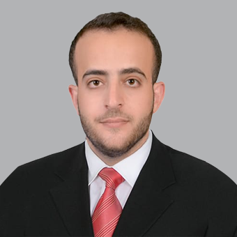

# Ahmad Z. Al Meslamani

**Drug Safety · Pharmacotherapy · Health Information Technology**

📍 Abu Dhabi, UAE

---

I trained as a pharmacist, and somewhere along the way, became fascinated by the questions that sit *between* clinical practice and data — questions like *why do prescribing errors keep happening, and what would actually fix them?* and *can a pharmacist on a phone change the course of a pandemic?*

Most of my work has been built around that intersection. I've spent years running randomised trials in community pharmacies, studying medication errors in hospital emergency departments, and watching telepharmacy go from a curiosity to a lifeline almost overnight during COVID-19. Lately I've been writing about how AI and machine learning could change the day-to-day of clinical pharmacy — from deprescribing in older adults to paediatric asthma care.

I currently serve as **Senior Laboratory Supervisor** at the College of Pharmacy at **Al Ain University**, and as a researcher at the **AAU Health & Biomedical Research Centre**. I'm now a **PhD candidate at UAEU**, doing the doctoral work alongside the day job. The dual role keeps me close to both the bench and the patient — which is, in the end, the whole point.

---

## Research

My work sits at three intersecting domains: **drug safety**, **clinical pharmacy practice**, and **health information technology** — running interventions, measuring what changes, and asking what role new technology can realistically play in pharmacy.

**Selected publications:**

- Al Meslamani AZ — *The Role of Pharmacists in Public Health and Disease Prevention: What Do We Know?* — **Clinical Pharmacy Connect 2025**
- Al Meslamani AZ et al. — *Adoption of electronic patient medication records in community pharmacies in the UAE* — **Health Information Management Journal 2025**
- Abdel-Qader DH, Al Meslamani AZ et al. — *Virtual Coaching Delivered by Pharmacists to Prevent COVID-19 Transmission* — **2022**
- Abdel-Qader DH, Al Meslamani AZ et al. — *The Role of Clinical Pharmacy in Preventing Prescribing Errors in the Emergency Department* — **2020**

→ Full list on [Google Scholar](https://scholar.google.com/citations?user=usUecnoAAAAJ&hl=en) or the [Publications page](https://scholarlybrightminds.github.io/ahmadalmeslamani/publications.html)

---

## Research Pillars

`Drug Safety` `Pharmacovigilance` `Prescribing Errors` `Dispensing Errors`  
`Clinical Pharmacy Practice` `Telepharmacy` `Deprescribing` `RCTs`  
`Health Information Technology` `Digital Health Policy` `e-Prescribing` `AI in Pharmacy`

---

## Currently

> *"Closer to the bench, closer to the patient. Both, somehow."*

- 🧪 PhD research at **UAEU** on the side of clinical pharmacy + digital health
- 🤖 Writing on AI-assisted deprescribing and ML in paediatric asthma care
- 🌍 eHealth policy frameworks for low- and middle-income countries
- 🏛️ Lab oversight + research at **AAU Health & Biomedical Research Centre**

---

*Part of the [ScholarlyBrightMinds](https://github.com/ScholarlyBrightMinds) academic network*

